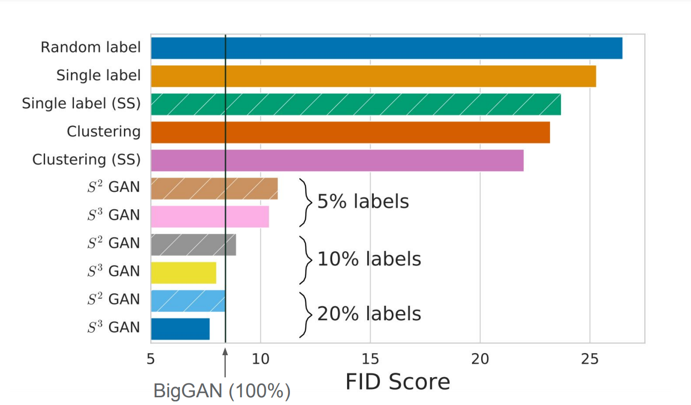
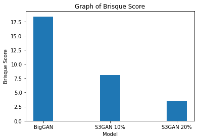

# Self-supervised and Semi-supervised Image Generation 
*Based on ‘High Fidelity Image Generation with Fewer Labels‘  by Mario Lucic et al.,2019* 
 
 :link:(https://arxiv.org/abs/1903.02271)
## Background 
*Generative Adversarial Networks (GANs)* are powerful machine learning models capable of generating realistic image, video, and voice outputs. The two neural networks that make up a GAN are referred to as the generator and the discriminator. The generator is a convolutional neural network and the discriminator is a deconvolutional neural network. The goal of the generator is to artificially manufacture outputs that could easily be mistaken for real data. The discriminator is to identify which outputs have been artificially created.In essence, GANs can create their own training data. As the feedback loop between the adversarial networks continues, the generator will begin to produce higher-quality output and the discriminator will become better at flagging data that has been artificially created.

## Proposed Work
Since GANs employ deep neural networks and the goal is to achieve image outputs that look realistic, it is essential to use a large dataset that is preferably labelled. But labelling millions of data points for each object we want to generate is not practical. Scaling these models in the future will also be increasingly difficult. This project uses methods such as **Semi-supervised** and **Self-supervised learning** to reduce the number of labels used in the training data. It also aims to match the performance of state of the art BigGAN using S3GANs with 10% of labels and outperforms the BigGAN with 20% labels.
## Results from the paper
We examine the results of S3GAN with available codebase against the state of the art BigGAN on ImageNet images. The authors of the paper use a metric called The Frechet Inception Distance(FID) to determine the quality of the images produced by different GANs. When only 10% of labels are fed to the network the images generated by S3GAN produces an FID score that is comparable with that of BIGGAN that uses 100% labels. While using 20% of the labels S3GAN outperforms it.

## Beyond the Paper
The claim made in the paper about image quality produced is validated using a metric called the BRISQUE score (short for Blind/Referenceless Image Spatial Quality Evaluator). This is a spatial domain natural scene statistic model that measures pointwise image luminescence based on deviations from a natural image model. A lower brisque score implies better image quality. Using images of resolution 128x128 from ImageNet the image quality of outputs of S3GAN and BigGAN on the class label ‘goldfish’ is validated. It is observed that BigGAN produces a Brisque score of 18.38. S3GAN with 10% labels renders a score of 8.03 and with 20% labels scores 3.42. As claimed in the paper, the **image quality improves significantly** while using S3GAN with varied percentage labels. 

#### Note
* Source code: https://github.com/google/compare_gan/blob/master/colabs/s3gan_demo.ipynb

* To run the existing code change 'tf' into 'tf.compat.v1' during import.
